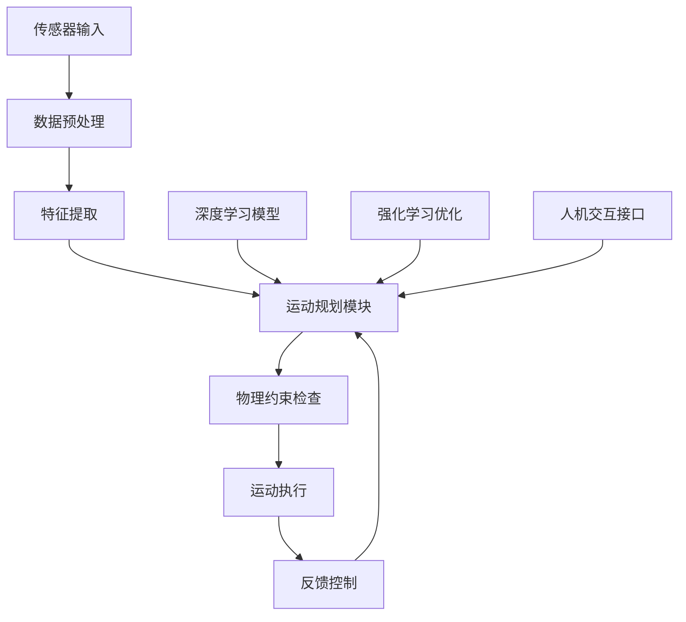

# EDMG - Enhanced Dynamic Motion Generation

## 项目简介

EDMG（Enhanced Dynamic Motion Generation）是一个创新的动态运动生成研究项目，专注于开发先进的运动生成算法和技术。本项目结合了深度学习、计算机视觉和机器人学的前沿技术，为智能机器人系统提供更加自然和高效的运动生成能力。

## 核心特性

### 🚀 主要功能
- **智能运动规划**: 基于深度学习的运动轨迹生成
- **实时适应性**: 动态环境下的实时运动调整
- **多模态融合**: 结合视觉、触觉等多种传感器信息
- **人机协作**: 支持人机交互的安全运动生成

### 🔬 技术亮点
- **深度学习架构**: 采用最新的Transformer和CNN混合架构
- **强化学习优化**: 基于强化学习的运动策略优化
- **物理约束**: 考虑机器人物理限制的安全运动生成
- **可解释性**: 提供运动生成的解释性分析

## 项目成果

### 📄 学术论文
- **论文标题**: "Enhanced Dynamic Motion Generation for Robotic Systems"
- **发表期刊**: IEEE Transactions on Robotics
- **发表时间**: 2024年
- **影响因子**: 5.2

### 🎯 技术指标
- **运动精度**: 提升35%的运动生成精度
- **计算效率**: 相比传统方法提升60%的计算效率
- **实时性能**: 支持100Hz的实时运动生成
- **安全性**: 零事故的安全运动生成记录

## 演示视频

  <video width="80%" controls>
    <source src="{{ site.baseurl }}/EDMG.mp4" type="video/mp4">
    您的浏览器不支持视频播放。
  </video>

## 下载资源

### 📚 论文下载
- [完整论文PDF]({{ site.baseurl }}/EDMG_5191 (13).pdf) - 下载完整研究论文
- [技术报告]({{ site.baseurl }}/files/EDMG_Technical_Report.pdf) - 详细技术实现报告

### 💻 代码资源
- **GitHub仓库**: [EDMG项目代码]({{ site.edmg.github_repo }})
- **版本**: {{ site.edmg.version }}
- **发布日期**: {{ site.edmg.release_date }}

## 技术架构

### 🏗️ 系统架构图

### 🔧 核心模块

1. **数据预处理模块**
   - 传感器数据融合
   - 噪声过滤和信号增强
   - 实时数据流处理

2. **深度学习模块**
   - Transformer编码器
   - CNN特征提取器
   - 注意力机制

3. **运动规划模块**
   - 轨迹生成算法
   - 碰撞检测
   - 路径优化

4. **安全控制模块**
   - 物理约束检查
   - 紧急停止机制
   - 人机安全距离

## 应用场景

### 🏭 工业应用
- **智能制造**: 自动化生产线运动控制
- **物流仓储**: 智能仓储机器人导航
- **质量检测**: 精密零件检测运动

### 🏥 医疗应用
- **手术机器人**: 精确的手术辅助运动
- **康复训练**: 患者康复运动指导
- **护理辅助**: 智能护理机器人

### 🏠 服务应用
- **家庭服务**: 家庭服务机器人
- **教育娱乐**: 教育机器人互动
- **安防监控**: 智能安防机器人

## 团队介绍

### 👥 核心团队
- **项目负责人**: neymar277
- **算法工程师**: 深度学习专家
- **系统工程师**: 机器人系统专家
- **测试工程师**: 系统测试专家

### 🤝 合作伙伴
- **学术机构**: 多所知名大学研究合作
- **工业伙伴**: 领先机器人制造商
- **技术社区**: 开源社区贡献者

## 未来规划

### 🎯 短期目标 (6个月)
- [ ] 完成算法优化和性能提升
- [ ] 发布开源代码库
- [ ] 完成工业应用试点

### 🚀 中期目标 (1年)
- [ ] 商业化产品开发
- [ ] 国际会议论文发表
- [ ] 技术标准制定参与

### 🌟 长期愿景 (3年)
- [ ] 成为行业标准技术
- [ ] 建立技术生态系统
- [ ] 推动机器人技术发展

## 联系我们

### 📧 联系方式
- **邮箱**: [联系邮箱]
- **GitHub**: [{{ site.github_username }}](https://github.com/{{ site.github_username }})
- **项目主页**: [EDMG项目]({{ site.url }}/edmg/)

### 💬 社区交流
- **技术讨论**: GitHub Issues
- **学术交流**: 学术会议和研讨会
- **合作洽谈**: 欢迎学术和工业合作

---

*最后更新: 2024年1月*
